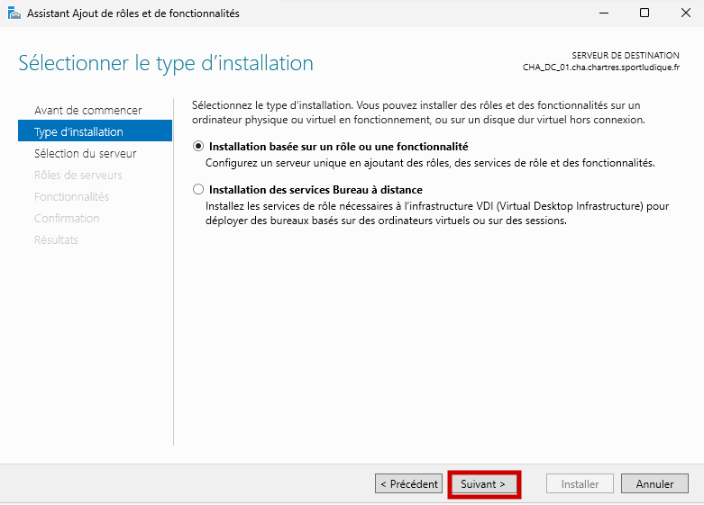
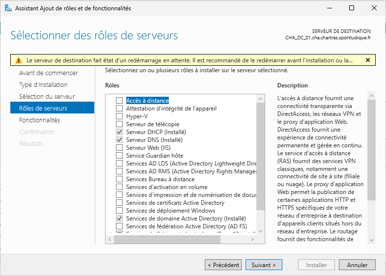

# Installer et configurer un serveur DHCP sur Windows Server 2025.

## Etape 1. Installation du rôle DHCP
Ouvrir le Gestionnaire de serveur.
Cliquer sur Gérer, puis sur Ajouter des rôles et fonctionnalités.

Choisir : « Installation basée sur un rôle ou une fonctionnalité ».

Sélectionner le serveur local.

Cocher **Serveur DHCP**, ajouter les fonctionnalités proposées.

Nous n’allons pas ajouté de fonctionnalité, nous pouvons faire suivant : 

